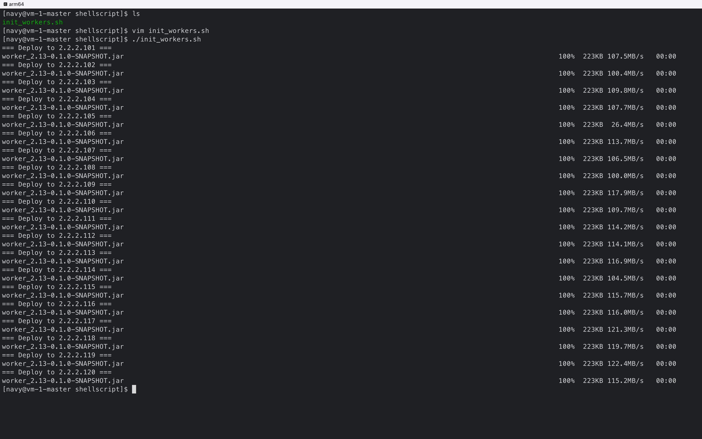
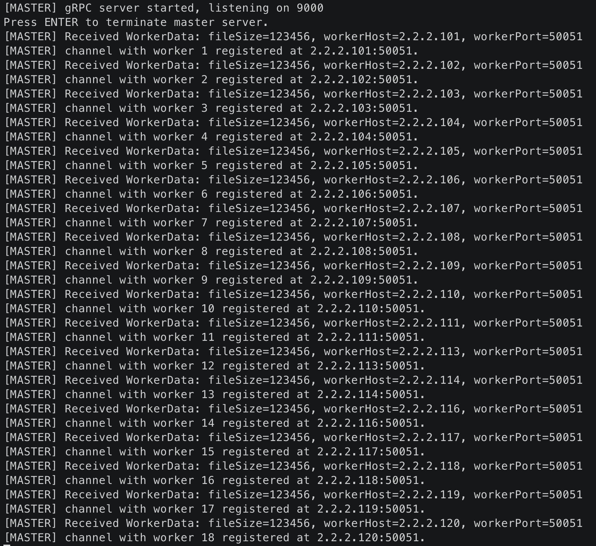
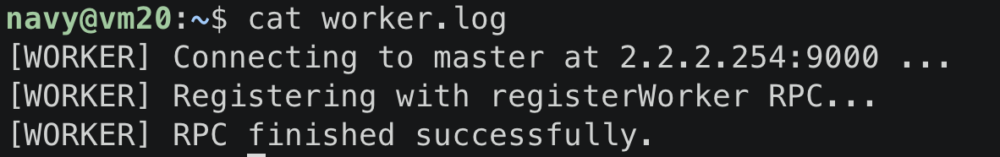
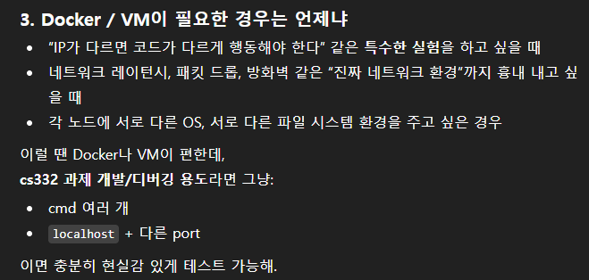

# 🗓 팀프로젝트 회의 기록 (6주차-2)

---

### 🧩 회의 기본 정보

- **주차:** 6주차
- **회의 일시:** 2025.11.23 10:40
- **참여자:** 박민혁, 이현수, 이준엽
- **회의 방식:** 비대면

---

### 🔄 프로젝트 진행도 및 Milestone 점검

> 지난 주 Milestone 진행사항 점검
> 
- [x]  현수
    - [ ]  docker 환경 구축
    - [ ]  master 기능 구현
    - [x]  발표 자료 만들어서 디코에 올리기
    1. shell script를 통해 마스터에서 모든 vm에게 worker.jar를 넘겨줄 수 있게 함
    
    : 처음 ssh/scp로 등록할 때는 ssh key에 등록할 지 말지 user가 직접 fingerprint를 남겨줘야 함. 이 과정 또한 shell script를 통해 자동화할 수 있을 듯
    
    : 우선은 testing을 위해 직접 해보긴 했음. 이를 통해 `init_workers.sh`를 실행하면 vm에 worker.jar 파일이 전달되는 것 확인 완료
    : 처음에 무슨 한국어 locale이 안 맞는다는 warning이 떴었는데 shell script에 아래를 추가함으로써 해결. 
    
    ```bash
    export LC_ALL=C
    export LANG=C
    ```
    
    
    
    - run_worekers.sh를 실행하다가 문제가 발생했다. vm에 `worker.jar` 파일까지는 잘 보내놨는데 run_worers.sh를 실행하니까 마스터와 워커 사이의 통신이 잘 안됐다. 그래서 플러그인이랑 뭘 좀 수정해서 sbt clean을 했는데 에러가 떴다. 맨 처음에 sbt clean 정도를 빌드 파일을 미는 커맨드 정도로 생각했었는데, 에러가 뜨는게 이상해서 찾아보니까 sbt에서는 로드가 제대로 되지 않으면 clean도 안된다고 한다. 여기거 우리가 사용하기로 한 플러그인이나 빌드 파일을 검토하고 clean한다는 것이다.
    
    1. `init_workers.sh`를 실행시켜서 마스터에 각각 워커 노드들이 등록을 마치게끔 하였다.
        
        
        
        
        
- 준엽
    - [ ]  worker 기능 구현
    - [ ]  worker에 gRPC 연결
    - [x]  발표 자료 만들어서 디코에 올리기
- 민혁
    - [x]  작성한 코드 버전 맞춰서 테스트 해보고 결과 공유하기
    - [x]  협업 방법, 프로젝트 개요 발표 자료 준비
    - [x]  발표 자료 수합해서 깃허브에 커밋

---

### 🎯 개별 논의 주제 제안

> 각자 생각하는 이번 논의때 다뤄보면 좋을 것들
> 
- 민혁: 시간이 부족하고 협업—특히 업무 공유—가 잘 안 되는 것 같음, 본인 역할이 불분명
    - docker 환경 구축은 뒤로 미루기 - 목적상 이상적인 test환경을 구축하는 것인데, 시간 상 우선순위를 낮게 둬도 크게 문제 없을 것 같음
    
    
    
    - git push 자주 하기 - 각자 branch 만들어서 하면 예전 버전으로 복구도 간편하고 업무 공유 최신화에 유리
    - 일주일 단위로 마일스톤을 정하지 말고, 좀 더 구체적으로 정할 필요가 있음
    - 시간상 구현이 어려운 요소 파악해서 과감히 배제 ex) Fault-Tolerance, cache-level optimization
    - 서로 깃허브 커밋 내용은 자세히 읽어보고 이해하기, 그리고 커밋 메시지 커밋의 의도와 목적이 드러나게 자세히 작성하기 - 확인 안하면 나중에 같은 걸 또 구현하거나 충돌나는 등 communication fail로 큰 시간 손실 가능성 커짐
    - 각자 작업하는 시간과 빈도가 다른데다 개인별 progress 공유 및 진전사항/결정요소 정리가 부족해서 나중에 참여하는 사람이 프로젝트 현황 파악에 시간이 많이 들게 됨 & 팀프로젝트가 처음이라 저를 포함한 모두가 documentation을 통한 업무 공유의 중요성/효율성에 대한 이해가 부족하고, 작성하는 방법과 형식에도 크게 어려움을 느끼고 시간도 많이 드는 것 같음 → 현실적인 대안: 매일 또는 특정 요일마다 일정 시간(대략 2시간 정도)동안 동시에 온라인으로 작업해서 진도를 쭉 뺄 수 있는 시간 확보 → 이렇게 하면 그동안 같이 공유한 내용에 대해서는 결정 사항이나 개인별 커밋 메시지 정도에만 투자해도 doucumentation은 충분

---

### 💬 주요 논의 주제

> 이번 주 회의의 핵심 목표나 논의 포인트를 간단히 요약
> 

프로젝트 완성까지의 목표와 확실한 마일스톤 수립

---

### 🧠 회의 내용 요약

> 자유롭게 대화 형식으로 아이디어, 제안, 문제 제기 등을 기록
> 

**💭 회의 대화 기록**

**🔄 프로젝트 진행도 및 Milestone 점검**

- 민혁
    - Sampling 일부 구현
- 준엽
    - 발표 잘한 팀 내용 정리
    - 정리 내용 바탕으로 코드 작성 돌입

**🎯 개별 논의 주제**

- 

**💬 주요 논의 주제**

- 

---

### ✅ 결정 사항

> 이번 회의에서 확정된 사항을 체크리스트로 기록
> 
- [ ]  각자 작업 전 git commit 내역 + DIFA 팔로우 업하기
- [ ]  작업 시 음성 채널 들어가서 하기 → 논의 사항 있다면 바로바로 토론할 수 있을 것
- [ ]  얘기 많이하기!!!

---

### 📍 다음 주 Milestone / To-Do

> 다음 주(7주차)까지 수행해야 할 과제, 테스트, 구현 목표 등
> 
- 일요일 (~11/23)
    - [ ]  준엽 - 로컬에서 sort 동작 성공 확인
    - [ ]  민혁 - Sampling 마무리
- sorting
    - 준엽
- partitioning
    - 준엽
- shuffle
    - 민혁
    - 다른 팀(cyan - download/upload) 발표에서 배울 거 배우기
- merge
    - 현수

→ 각자 토요일 전까지 로컬 테스트 완료

→ 토요일에 모여서 코드 통합 + 클러스터 테스팅 진행

→ 일요일에 concurrency + efficiency? 정도 고민 + 보고서

---