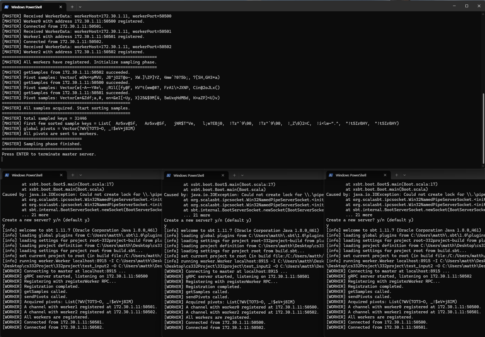
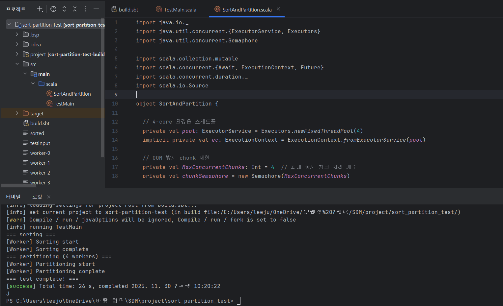

# 🗓 팀프로젝트 회의 기록 (7주차)

---

### 🧩 회의 기본 정보

- **주차:** 7주차
- **회의 일시:** 2025.11.30 19:00
- **참여자:** 박민혁, 이현수, 이준엽
- **회의 방식:** 비대면

---

### 🔄 프로젝트 진행도 및 Milestone 점검

> 지난 주 Milestone 진행사항 점검
> 
- 일요일 (~11/23)
    - [x]  준엽 - 로컬에서 sort 동작 성공 확인
    - [x]  민혁 - Sampling 마무리
- sorting
    - 준엽
- partitioning
    - 준엽
- shuffle
    - 민혁
    - 다른 팀(cyan - download/upload) 발표에서 배울 거 배우기
- merge
    - 현수
1. local에서 sampling phase 완료



1. local에서 sorting 완료



---

### 🎯 개별 논의 주제 제안

> 각자 생각하는 이번 논의때 다뤄보면 좋을 것들
> 
- 현수
1. sampling 코드를 보면 전체 파일 합쳐서 1MB를 sampling하는 방식. 하나의 input 디렉토리를 하나의 디스크로 인식하면 되나?

```scala
val bytesPerFile: Long = sampleBytes / numFiles
```

1. sort/partition 구현?

[데이터베이스의 Sorting(정렬) 알고리즘 (External Sort-Merge)](https://durumiss.tistory.com/51)

- block size?
- 각 block을 RAM에 올려서 sorting 진행 후 다시 disk에 저장
- vm 별로 sorting이 완료되면 pivot을 기준으로 partitioning

<cyan 팀 아이디어>

- partition 이후 shuffle 전에 synchronize가 필요. shuffle 전에 모든 vm이 sort/partition을 완료해야 하기 때문
- 그리고 shuffling에서 pull 방식 채택
- push - sender가 receiver에게 데이터 전송
- pull - receiver가 sender에게 데이터 전송 요청

→ push 방식을 선택하면 이미 receiver가 다른 데이터를 받고 있는데(즉, 완료가 안되었는데) 다음 전송이 시작될 수도 있고, 만약 worker가 데이터를 다 받지 못했을 때 어디서부터 다시 받아야하는지 알 수 없음.

하지만 pull 방식의 경우 receiver가 필요한 순간 server가 data를 보낼 수 있고, 덕분에 receiver는 자신의 state를 명확히 아는 상황에서 data를 받을 수 있음. fault tolerance에 유용

<내 아이디어>

- 만약 20개의 vm을 이용해서 distributed sorting을 한다고 했을 때, 순서대로 데이터를 받으면 될 듯

e.g. vm0이 다른 vm으로부터 데이터를 받는 상황

vm1에 send 요청 → chunk 0, chunck 1, … 전송 → vm1은 send 완료

vm2에 send 요청 → …

이런 방식

- 이를 구현하기 위해 필요한 metadata 생각해보기
1. partition 이후 한 block 안에 있는 chunk들이 각각 어느 disk(directory)로 이동해야하는 지 마킹해주는 데이터 필요 (e.g. vm 별로 id 지정?)
2. 파트 분배 생각해봤을 때 sorting과 shuffling에 더 큰 에너지가 들어갈 것이라고 생각. task를 더 세분화해서 다같이 최대한 빨리 구현하고 testing 해보는 과정을 거치는 게 좋을 듯함. 

---

### 💬 주요 논의 주제

> 이번 주 회의의 핵심 목표나 논의 포인트를 간단히 요약
> 
- 순서 : sampling → block 별로 sorting → merge → partitioning → shuffling
- 이를 통해 shuffle 단계에서 너무 많은 communication overhead가 발생하는 것을 막을 수 있을 것으로 예상
- block 하나를 다시 worker 수만큼 쪼개서 각각을 주고받는 것은 communication overhead가 클 것으로 예상

---

### 🧠 회의 내용 요약

> 자유롭게 대화 형식으로 아이디어, 제안, 문제 제기 등을 기록
> 

**💭 회의 대화 기록**

**🔄 프로젝트 진행도 및 Milestone 점검**

- 각각의 기능 구현 완료 → cluster에 올려서 테스팅 해보기

**🎯 개별 논의 주제**

- pull 방식 - receiver가 sender에게 data를 요청하는 방식으로 shuffle을 구현

**💬 주요 논의 주제**

- sampling → block 별로 sorting → merge → partitioning → shuffling → 최종 merge

---

### ✅ 결정 사항

> 이번 회의에서 확정된 사항을 체크리스트로 기록
> 
- [ ]  

---

### 📍 다음 주 Milestone / To-Do

> 다음 주(4주차)까지 수행해야 할 과제, 테스트, 구현 목표 등
> 

~ 월

- [ ]  cluster 환경에서 sampling 완성 - 민혁

~화

- [ ]  sampling 완성되면 cluster 환경에 sort/partition 기능 병합 - 준엽
- [ ]  shuffle 부분 local 코드 구현 - 현수

~수

- [ ]  shuffle 부분 cluster 환경 병합

- [ ]  cluster에서 동작하는 거 확인
- [ ]  시나리오 별 테스트케이스 작성 & 테스팅
- [ ]  concurrency exploit할 수 있는 방안 생각해보기

---
